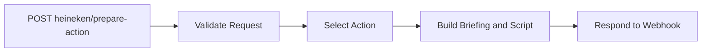
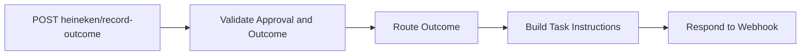

# HEINEKEN Customer Retention Copilot — n8n layer

This directory contains two isolated, inactive n8n workflow exports. They use supplied account evidence, create deterministic copy or task instructions, and never send messages, call customers, write to an external CRM, or persist customer data.

## Files

- `workflows/heineken-prepare-action.json` — **HEINEKEN — Prepare Action**
- `workflows/heineken-record-outcome.json` — **HEINEKEN — Record Outcome**
- `contracts/*.schema.json` — request and response definitions in JSON Schema Draft 2020-12
- `examples/*.json` — success and error fixtures
- `tests/verify-workflows.mjs` — local behavioral checks against the exported Code-node source
- `VERIFICATION.md` — executed versus pending verification

## Workflow diagrams





## Prepare Action

`POST /webhook/heineken/prepare-action` in production, or `/webhook-test/heineken/prepare-action` while listening in the n8n editor.

The required fields are `accountId`, `analysisDate`, `actionType`, and `evidence`. Evidence is deliberately sparse: every evidence property may be omitted or explicitly `null`, and neither case becomes zero. Supported properties are:

| Property | Type when available |
| --- | --- |
| `daysSinceLastOrder` | non-negative number |
| `typicalOrderingIntervalDays` | non-negative number |
| `spendingDeclinePercent` | number from 0 to 100 |
| `droppedCategories` | array of non-empty strings |
| `recentReviewScore` | number from 0 to 5 |
| `deliveryLatenessDays` | non-negative number |
| `riskReasons` | array of non-empty strings |
| `riskScore` | number from 0 to 100; a relative attention score, never a probability |
| `evidenceConfidence` | `low`, `medium`, `high`, or `unavailable` |
| `unresolvedServiceIssue` | boolean |
| `reviewText` | untrusted string; validated but not used by deterministic templates |

Node behavior:

1. **Prepare Action Webhook** accepts POST and uses an n8n Header Auth credential.
2. **Validate Request** returns HTTP 400-style structured errors for missing, malformed, or unsupported values.
3. **Select Action** gives `service_recovery` precedence when `unresolvedServiceIssue` is exactly `true`.
4. **Build Briefing and Script** uses only supplied structured facts. Low/unavailable confidence removes fact recitation from the spoken script and asks the representative to verify the situation. Causes remain questions. No discount, compensation, resolution, or other promise is made.
5. **Respond to Webhook** returns the prepared response or error using the selected HTTP code.

All successful responses require approval and currently return `generationMode: "template"`. There is no Gemini node in this version: the deterministic path is the working product and safe fallback. If AI drafting is added later, keep provider credentials in n8n, pass only structured evidence (never instructions from `reviewText`), validate output against the same response schema, and route provider/timeout/parse/schema failures back to the template node.

## Record Outcome

`POST /webhook/heineken/record-outcome` in production, or `/webhook-test/heineken/record-outcome` while listening in the editor.

`approved` must be exactly `true`; `mode` must be `simulation`; `contactDate` must be a simulation date in `YYYY-MM-DD`. `callback_requested` requires `callbackAt`. `order_received` requires `monitoring` containing exactly one of `date` or positive integer `intervalDays`.

Node behavior:

1. **Record Outcome Webhook** accepts POST and uses the same kind of Header Auth credential.
2. **Validate Approval and Outcome** enforces approval, simulation mode, supported outcomes, and outcome-specific dates.
3. **Route Outcome** contains the single timing configuration. It uses calendar days in UTC: service escalation 0, category proposal 2, demand review 30, and no-response follow-up 3 days after `contactDate`.
4. **Build Task Instructions** derives dates only from the supplied `contactDate`, `callbackAt`, or `monitoring`; it never reads server time. The pure FNV-1a ID is derived from `eventId + task type`, so retries produce the same logical `taskId`.
5. **Respond to Webhook** returns the action status and upsert/cancel instructions.

For `order_received`, only open `retention_contact_reminder` tasks are selected for cancellation. `service_issue_resolution` is explicitly excluded. The workflow schedules a monitoring task and states that one order is not proof of sustained recovery.

## Persistence and duplicate behavior

n8n does not persist tasks or provide persistent deduplication in this phase. The app owns browser storage and must:

- upsert returned tasks by `taskId`;
- prevent multiple open tasks for the same `accountId` and `purpose`;
- apply only explicit items in `taskInstructions.cancel`; and
- never infer cancellation of unrelated service tasks.

Adding durable n8n-level deduplication later requires an explicit storage layer and is outside this prototype.

## Import and secure configuration

1. Import each file in `workflows/` into n8n. They are inactive by design.
2. In n8n, create a **Header Auth** credential named `HEINEKEN Webhook Secret`, with header name `x-webhook-secret` and a strong value.
3. Open each Webhook node and bind that credential, replacing the unresolved `REPLACE_AFTER_IMPORT` reference.
4. Save each workflow. Do not activate it until test-webhook checks pass.
5. Keep the same secret only in the server environment as `N8N_WEBHOOK_SECRET`; never expose it through React or a `VITE_*`/`NEXT_PUBLIC_*` variable.
6. After testing, activate the workflows and change the proxy URLs from n8n test URLs to the production webhook URLs.

The exports intentionally include no credential values, raw CSV data, account fixtures from production, AI keys, database nodes, or live-system connectors.

## Local tests

Prerequisite: Node.js 18 or newer.

```bash
node n8n/tests/verify-workflows.mjs
find n8n -name '*.json' -print0 | xargs -0 -n1 node -e 'JSON.parse(require("fs").readFileSync(process.argv[1], "utf8"))'
```

To exercise n8n locally, import and bind the credential, click **Listen for test event**, then call the displayed `/webhook-test/...` URL:

```bash
jq '.request' n8n/examples/prepare-action.success.json | curl -i "$N8N_ACTION_WEBHOOK_URL" \
  -H 'content-type: application/json' \
  -H "x-webhook-secret: $N8N_WEBHOOK_SECRET" \
  --data-binary @-
```

The example files wrap payloads in `request`/`response` for documentation, so the command extracts only `request`. The same applies to Record Outcome fixtures.

## Server-side proxy integration

The repository implements the proxy in `server/n8n-proxy.mjs` and exposes it through both Vite development middleware and the production `server/index.mjs`. The React app calls only `POST /api/prepare-action` and `POST /api/record-outcome`. Each route accepts JSON, performs body/size checks, forwards the JSON unchanged, preserves the n8n HTTP status and JSON body, and applies a timeout. The only server environment variables are:

```text
N8N_ACTION_WEBHOOK_URL=https://n8n.example/webhook/heineken/prepare-action
N8N_OUTCOME_WEBHOOK_URL=https://n8n.example/webhook/heineken/record-outcome
N8N_WEBHOOK_SECRET=replace-with-a-secret
```

Minimal framework-neutral forwarding logic:

```ts
async function forwardToN8n(url: string, body: unknown) {
  const response = await fetch(url, {
    method: 'POST',
    headers: {
      'content-type': 'application/json',
      'x-webhook-secret': process.env.N8N_WEBHOOK_SECRET!,
    },
    body: JSON.stringify(body),
    signal: AbortSignal.timeout(10_000),
  });

  const payload = await response.json();
  return { status: response.status, body: payload };
}
```

Map `/api/prepare-action` to `N8N_ACTION_WEBHOOK_URL` and `/api/record-outcome` to `N8N_OUTCOME_WEBHOOK_URL`. Do not silently reshape responses: the frontend’s local fallback should implement the exact success/error shapes in `contracts/`. Do not retry non-idempotent calls with a new `eventId`; a Record Outcome retry must preserve its original `eventId` so the `taskId` remains stable.

## HTTP behavior

- `200` — successful template or task instruction response
- `400` — malformed, missing, unsupported, or outcome-specific input
- `403` — otherwise-valid Record Outcome request where `approved !== true`
- `401` — produced by n8n Header Auth for a missing or wrong webhook secret

See `examples/` for successful branches, missing evidence, invalid requests, unapproved outcomes, unsupported values, and the template-fallback behavior.
